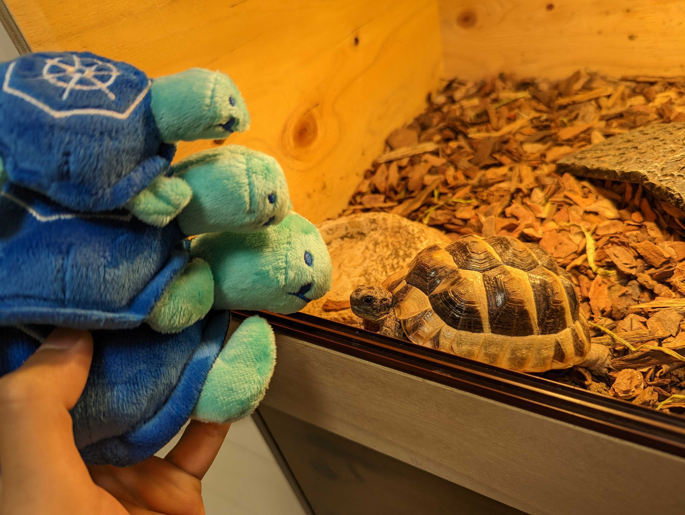

# tortoise

Tortoise, it's an animal living in the Kubernetes cluster.

Tortoise, you need to feed only very few parameters to them.

Tortoise, it'll soon start to eat historical usage data of Pods.

Tortoise, it likes changing HPA, VPA, and Pods resource request/limit based on historical usage data.

Tortoise, once you start to live with them, you no longer need to configure HPA, VPA, Pod's resource request/limit by yourself.

Tortoise, now you know, it's not only cute but also everything you need to manage your Kubernetes resources with minimum effort.

## Install

Tortoise, you cannot get it from the breeder.

Tortoise, you need to get it from GitHub instead.

TODO: add how to install on the cluster.

Tortoise, you don't need a rearing cage, but need VPA in your Kubernetes cluster before installing it.

## How it works

TODO: add the strategies.

## Note

It's implemented based on our experience for the workloads in Mercari.
Depending on how your workloads look like, tortoise may or may not fit your workloads.

Also, probably, this repository will be moved to @mercari organization in the future.
